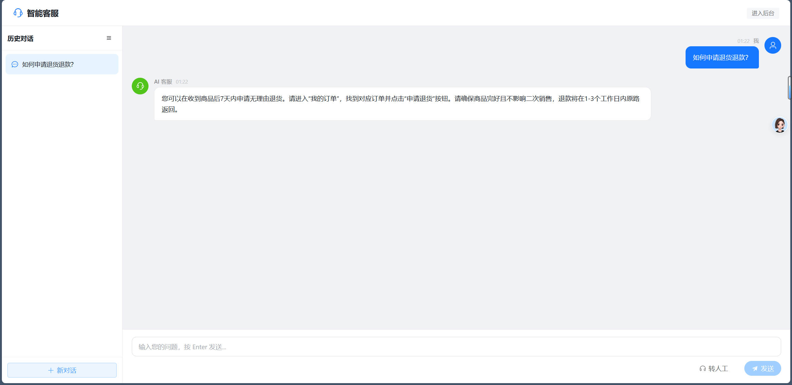
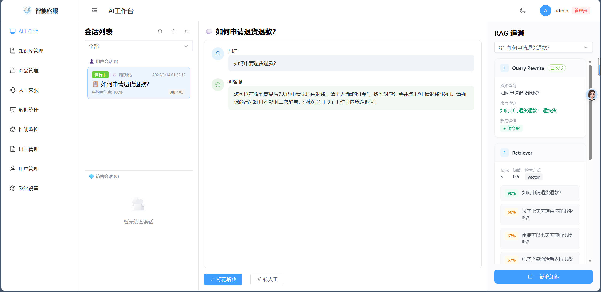
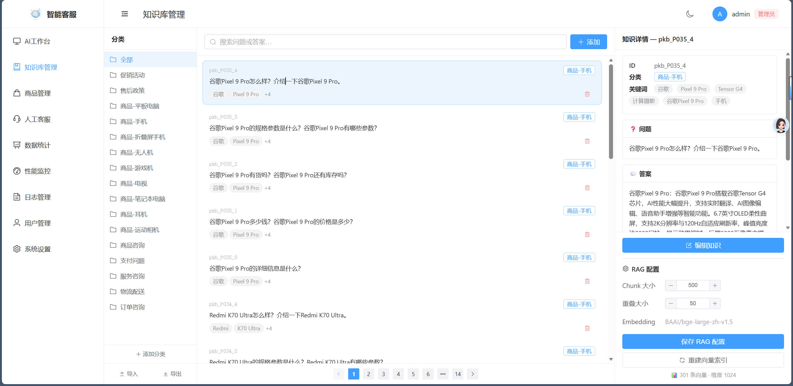
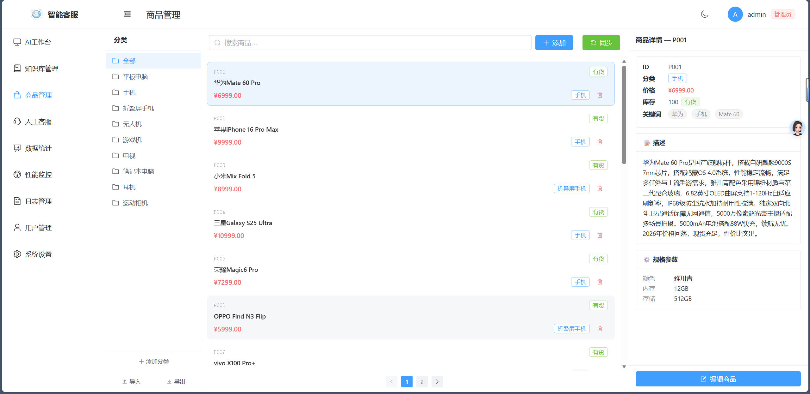
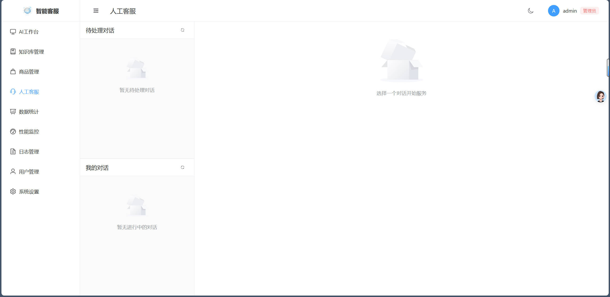
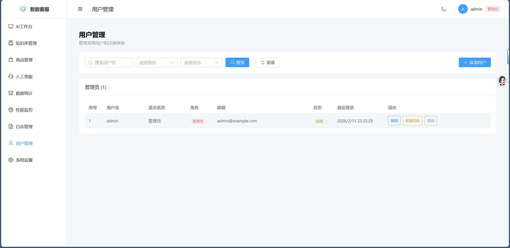
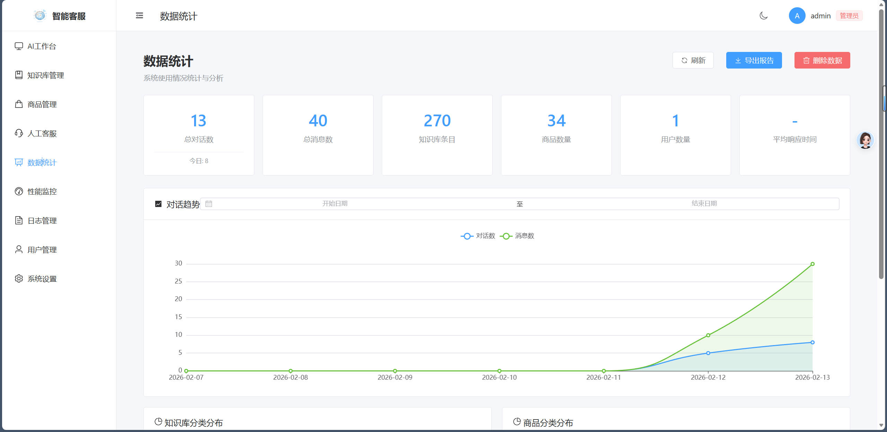
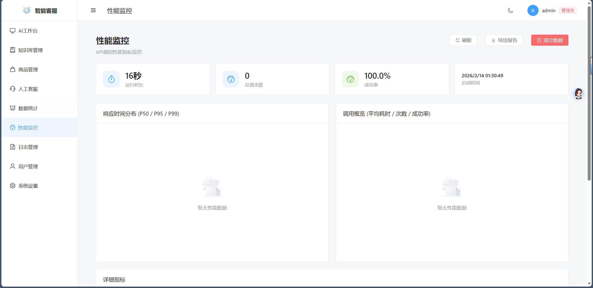
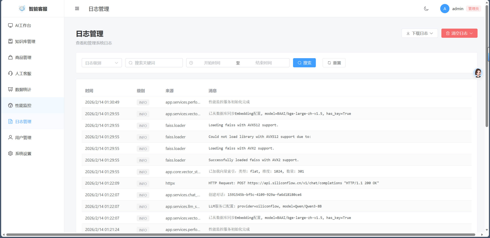
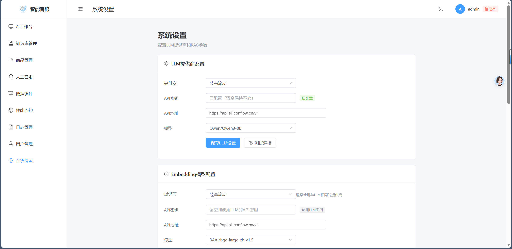

# 智能电商客服 RAG 系统

基于 **Vue 3 + FastAPI** 的前后端分离智能电商客服系统，集成 FAISS 向量检索的 RAG（检索增强生成）能力，支持 AI 自动应答、人工客服实时接管、知识库管理等完整客服工作流。

## 系统架构

```
┌──────────────────────────────────────────────────────────────┐
│                  前端 (Vue 3 + Element Plus)                  │
│  ┌──────────┐ ┌──────────┐ ┌──────────┐ ┌──────────┐        │
│  │Vue Router│ │  Pinia   │ │  Axios   │ │WebSocket │        │
│  └──────────┘ └──────────┘ └──────────┘ └──────────┘        │
└────────────────────────┬─────────────────────────────────────┘
                         │ REST / SSE / WebSocket
┌────────────────────────┴─────────────────────────────────────┐
│                    后端 (FastAPI)                              │
│  ┌──────────┐ ┌──────────┐ ┌──────────┐ ┌──────────┐        │
│  │   Auth   │ │   Chat   │ │Knowledge │ │ Product  │        │
│  │ Service  │ │ Service  │ │ Service  │ │ Service  │        │
│  └──────────┘ └──────────┘ └──────────┘ └──────────┘        │
│  ┌──────────┐ ┌──────────┐ ┌──────────┐ ┌──────────┐        │
│  │   RAG    │ │   LLM    │ │  Vector  │ │  Human   │        │
│  │  Engine  │ │ Service  │ │  Store   │ │ Service  │        │
│  └──────────┘ └──────────┘ └──────────┘ └──────────┘        │
│  ┌──────────┐ ┌──────────┐                                   │
│  │WSManager │ │Rate Limit│                                   │
│  └──────────┘ └──────────┘                                   │
└────────────────────────┬─────────────────────────────────────┘
                         │
┌────────────────────────┴─────────────────────────────────────┐
│                       数据层                                  │
│     ┌───────────────┐            ┌───────────────┐           │
│     │  SQLite (异步) │            │  FAISS Index  │           │
│     └───────────────┘            └───────────────┘           │
└──────────────────────────────────────────────────────────────┘
```

## 通信机制

系统采用 **WebSocket + REST API + SSE** 混合架构，WebSocket 连接管理器支持三维度推送：

| 维度 | 连接方 | 用途 |
|------|--------|------|
| conversation_id | 客服 → 特定对话 | 对话内实时消息收发 |
| customer_id | 客户 → 自身所有对话 | 接收消息、状态变更 |
| agent_global | 客服 → 全局通道 | 跨对话事件通知（新待处理、状态变更） |

| 场景 | 协议 | 说明 |
|------|------|------|
| AI 对话回复 | SSE | 流式输出，逐字显示 AI 回复 |
| 人工客服消息 | WebSocket | 客户与客服之间的实时双向通信 |
| 状态变更通知 | WebSocket | 转人工、接入、关闭等状态通过统一发布器三维度广播 |
| 数据查询/操作 | REST API | 对话列表、知识库 CRUD、用户管理等 |
| 降级保底 | REST 轮询 | WebSocket 断连时自动降级为轮询（2s 快速 / 30s 保底） |

## 功能特性

### 客户端
- 智能问答对话（SSE 流式响应，逐字输出）
- 访客模式（自动分配 guest token，无需登录）
- 客户登录/注册后自动迁移访客对话记录（支持 visitor_id、device_id、conversation_id 三路匹配）
- 对话历史管理（创建、切换、删除）
- 一键转人工客服，低置信度自动提示
- WebSocket 实时接收人工客服消息
- 消息软删除（客户可删除自己发送的消息）

### 管理后台
- **AI 工作台**：会话总览、RAG 追溯（Query Rewrite → Retriever → Context → 置信度 → Final Prompt）
- **知识库管理**：增删改查、批量导入导出（JSON/CSV）、向量索引重建、分块检索
- **商品管理**：商品信息维护、自动同步到知识库（生成 QA 对）
- **人工客服**：实时接管对话、WebSocket 双向通信、心跳保活、WS 断连降级轮询提示
- **用户管理**：管理员/客服/客户三级角色、注册审批、账号启停、密码重置
- **数据统计**：对话趋势、分类分布、热门问题（ECharts 可视化）
- **性能监控**：API 耗时统计、P50/P95/P99 指标
- **日志管理**：日志查看、级别筛选、关键词搜索、时间范围过滤、下载、清空
- **系统设置**：LLM 提供商配置、RAG 参数调优、Embedding 配置、时区设置
- **数据备份**：数据库备份与恢复、JSON 数据导出

### 技术特性
- JWT 双令牌认证（access + refresh）+ 访客令牌
- RBAC 三级权限控制（admin / cs / customer）
- SSE 流式响应 + WebSocket 实时通信 + REST 降级轮询
- 统一 WebSocket 连接管理器（customer_id / conversation_id / agent_global 三维度）
- 统一状态变更发布器（`publish_status_change`），所有状态转换三维度一致广播
- 前端临时消息使用负数 ID，避免污染 `since_id` 增量拉取；SSE/WS 回包后就地替换为服务端真实 ID
- FAISS 向量检索（支持降级到 numpy 纯计算）
- RAG 管线：查询改写（停用词过滤 + 同义词扩展）→ 多路向量检索 → 关键词覆盖度加权 → 上下文构建
- 知识库分块索引，chunk 级精准检索
- 多 LLM 提供商热切换（OpenAI / 硅基流动 / 通义千问 / 智谱 / DeepSeek）
- Token Bucket 速率限制中间件（per-IP）
- JWT 密钥安全检查（启动时检测默认值，生产环境拒绝启动）
- 敏感配置加密存储（Fernet 对称加密，密钥从 JWT_SECRET_KEY 派生）
- 日志时区与系统设置同步（`_TzAwareFormatter`，设置页面变更时实时生效）
- 系统设置变更审计日志（记录操作者、变更项，API Key 仅记录是否变更）
- 183 个后端单元测试

---

## 页面截图

### 客户对话


### AI 工作台


### 知识库管理


### 商品管理


### 人工客服


### 用户管理


### 数据统计


### 性能监控


### 日志管理


### 系统设置


---

## 快速开始

提供两种部署方式：[Docker 一键部署](#docker-部署推荐) 和 [手动部署](#手动部署)。

### Docker 部署（推荐）

#### 环境要求

- Docker 20.10+
- Docker Compose V2+

#### 1. 准备配置

```bash
# 复制环境变量模板
cp .env.example .env

# 编辑 .env，修改 JWT_SECRET_KEY（必须）
# 可用以下命令生成随机密钥：
python -c "import secrets; print(secrets.token_urlsafe(64))"
```

#### 2. 构建并启动

```bash
docker-compose up -d --build
```

#### 3. 访问服务

- 前端页面：http://localhost
- 客户问答：http://localhost/（无需登录）
- 后台管理：http://localhost/workbench（需登录）
- API 文档：http://localhost/docs
- 健康检查：http://localhost/api/health

#### 常用命令

```bash
# 查看日志
docker-compose logs -f

# 停止服务
docker-compose down

# 重启服务
docker-compose restart

# 重新构建并启动（代码更新后）
docker-compose up -d --build
```

> **数据持久化**：数据库和向量索引存储在 Docker volumes 中（`backend-data`、`backend-logs`），删除容器不会丢失数据。执行 `docker-compose down -v` 会同时删除数据卷。

---

### 手动部署

#### 环境要求

- Python 3.10+
- Node.js 18+
- npm

### 1. 后端安装

```bash
cd backend

# 创建并激活虚拟环境
python -m venv .venv
# Windows
.venv\Scripts\activate
# Linux/macOS
source .venv/bin/activate

# 安装依赖
pip install -r requirements.txt
```

### 2. 配置环境变量

在 `backend/` 目录下创建 `.env` 文件：

```bash
# 生成随机 JWT 密钥
python -c "import secrets; print('JWT_SECRET_KEY=' + secrets.token_urlsafe(64))"
```

将输出写入 `.env` 文件，或手动创建：

```env
# JWT 密钥（必须修改，否则启动时会输出安全警告）
JWT_SECRET_KEY=这里替换为上面生成的随机字符串

# 可选配置
DEBUG=false
DATABASE_URL=sqlite+aiosqlite:///./data/app.db
RATE_LIMIT_REQUESTS=100
RATE_LIMIT_WINDOW_SECONDS=60
```

> **注意**：更换 JWT_SECRET_KEY 后，数据库中已加密的敏感配置（如 LLM API Key）需要在管理后台重新填写。

### 3. 前端安装

```bash
cd frontend
npm install
```

### 4. 启动服务

```bash
# 启动后端（在 backend 目录下）
cd backend
uvicorn app.main:app --reload --host 0.0.0.0 --port 8000

# 启动前端（在 frontend 目录下）
cd frontend
npm run dev
```

- 前端地址：http://localhost:3000
- 客户问答页面：http://localhost:3000/（无需登录）
- 后台管理：http://localhost:3000/workbench（需登录）
- API 文档：http://localhost:8000/docs

### 5. 默认账号

首次运行自动创建管理员账号：
- 用户名：`admin`
- 密码：`admin123`

> 建议登录后立即修改默认密码。

---

## 项目结构

```
├── docker-compose.yml            # Docker 编排
├── .env.example                  # Docker 环境变量模板
├── .dockerignore                 # Docker 构建忽略
│
├── backend/
│   ├── Dockerfile                # 后端容器构建
│   ├── app/
│   │   ├── api/                  # API 路由层
│   │   │   ├── auth.py           # 认证（登录/注册/刷新/访客令牌）
│   │   │   ├── chat/             # 对话模块（子包）
│   │   │   │   ├── conversations.py  # 对话 CRUD
│   │   │   │   ├── messages.py   # 消息查询（分页 + since_id 增量）
│   │   │   │   ├── streaming.py  # SSE 流式响应 + 消息发送
│   │   │   │   ├── transfer.py   # 转人工客服
│   │   │   │   ├── websocket.py  # 客户 WebSocket
│   │   │   │   ├── debug.py      # RAG 调试
│   │   │   │   └── dependencies.py # LLM/RAG 服务依赖注入
│   │   │   ├── human.py          # 人工客服 REST API
│   │   │   ├── human_ws.py       # 人工客服 WebSocket（对话级 + 全局）
│   │   │   ├── knowledge.py      # 知识库管理
│   │   │   ├── product.py        # 商品管理
│   │   │   ├── users.py          # 用户管理
│   │   │   ├── statistics.py     # 数据统计
│   │   │   ├── performance.py    # 性能监控
│   │   │   ├── logs.py           # 日志管理
│   │   │   ├── settings.py       # 系统设置（含变更审计日志）
│   │   │   ├── backup.py         # 数据备份
│   │   │   └── dependencies.py   # 公共依赖注入（认证、RBAC）
│   │   ├── models/               # SQLAlchemy ORM 模型
│   │   ├── schemas/              # Pydantic 请求/响应模式
│   │   ├── services/             # 业务逻辑层
│   │   │   ├── chat_service.py   # 对话/消息 CRUD
│   │   │   ├── human_service.py  # 人工客服状态机
│   │   │   ├── rag_service.py    # RAG 检索引擎
│   │   │   ├── llm_service.py    # LLM 调用（多提供商）
│   │   │   ├── vector_service.py # 向量检索服务
│   │   │   ├── ws_manager.py     # 统一 WebSocket 连接管理（三维度）
│   │   │   ├── knowledge_service.py
│   │   │   ├── product_service.py
│   │   │   ├── auth_service.py
│   │   │   ├── settings_service.py
│   │   │   ├── statistics_service.py
│   │   │   ├── performance_service.py
│   │   │   ├── log_service.py
│   │   │   └── backup_service.py
│   │   ├── core/                 # 核心模块
│   │   │   ├── config.py         # 运行时配置
│   │   │   ├── embedding.py      # Embedding 客户端
│   │   │   ├── llm_providers.py  # LLM 提供商注册
│   │   │   └── vector_store.py   # FAISS 向量存储
│   │   ├── utils/                # 工具函数
│   │   │   └── time.py           # 时区安全的 utcnow()
│   │   ├── middleware/           # 中间件
│   │   │   └── rate_limit.py     # Token Bucket 速率限制
│   │   ├── migrations/           # 数据迁移脚本
│   │   ├── config.py             # 应用配置（环境变量）
│   │   ├── database.py           # 异步数据库连接
│   │   └── main.py               # FastAPI 入口 + 日志配置
│   ├── tests/                    # pytest 测试（183 个用例）
│   ├── data/                     # 数据目录
│   │   ├── app.db                # SQLite 数据库
│   │   ├── backups/              # 数据库备份
│   │   ├── vectors.index         # FAISS 向量索引
│   │   └── vectors_map.json      # 向量 ID 映射
│   ├── logs/                     # 日志文件
│   │   ├── app.log               # 应用日志 (INFO+)
│   │   └── error.log             # 错误日志 (ERROR+)
│   ├── .env                      # 环境变量（不入版本控制）
│   ├── pytest.ini
│   └── requirements.txt
│
├── frontend/
│   ├── Dockerfile                # 前端容器构建（多阶段）
│   ├── nginx.conf                # Nginx 反向代理配置
│   ├── src/
│   │   ├── api/                  # API 调用封装（按模块拆分）
│   │   ├── views/                # 页面视图
│   │   │   ├── CustomerChat.vue  # 客户问答页
│   │   │   ├── Workbench.vue     # AI 工作台
│   │   │   ├── Knowledge.vue     # 知识库管理
│   │   │   ├── Products.vue      # 商品管理
│   │   │   ├── HumanService.vue  # 人工客服
│   │   │   ├── Users.vue         # 用户管理
│   │   │   ├── Statistics.vue    # 数据统计
│   │   │   ├── Performance.vue   # 性能监控
│   │   │   ├── Logs.vue          # 日志管理
│   │   │   ├── Settings.vue      # 系统设置
│   │   │   └── Login.vue         # 登录/注册
│   │   ├── components/           # 公共组件
│   │   ├── stores/               # Pinia 状态管理
│   │   ├── router/               # 路由 + 权限守卫
│   │   ├── types/                # TypeScript 类型定义
│   │   └── utils/
│   │       ├── request.ts        # Axios 封装（拦截器、token 刷新）
│   │       ├── websocket.ts      # WebSocket 客户端（自动重连、心跳）
│   │       ├── safeMarkdown.ts   # Markdown 安全渲染
│   │       └── guestIdentity.ts  # 访客身份管理（device_id、conversation_id 记忆）
│   ├── index.html
│   ├── package.json
│   ├── tsconfig.json
│   └── vite.config.ts
│
└── doc/                          # 项目文档
```

---

## API 接口

### 认证
| 方法 | 路径 | 说明 |
|------|------|------|
| POST | /api/auth/login | 用户登录 |
| POST | /api/auth/register | 客服注册（需管理员审批） |
| POST | /api/auth/register-customer | 客户注册（自动激活） |
| POST | /api/auth/refresh | 刷新令牌 |
| POST | /api/auth/guest | 获取访客令牌 |
| GET | /api/auth/me | 获取当前用户信息 |

### 对话
| 方法 | 路径 | 说明 |
|------|------|------|
| POST | /api/chat/conversations | 创建对话 |
| GET | /api/chat/conversations | 获取对话列表（分页） |
| GET | /api/chat/conversations/{id} | 获取对话详情 |
| PUT | /api/chat/conversations/{id} | 更新对话 |
| DELETE | /api/chat/conversations/{id} | 删除对话 |
| DELETE | /api/chat/conversations | 删除所有对话（仅 admin） |
| POST | /api/chat/conversations/{id}/messages | 发送消息（SSE 流式） |
| GET | /api/chat/conversations/{id}/messages | 获取消息历史（分页 / since_id 增量） |
| DELETE | /api/chat/conversations/{id}/messages/{mid} | 删除消息（软删除 / 硬删除） |
| POST | /api/chat/conversations/{id}/transfer-human | 转人工客服 |
| POST | /api/chat/debug-rag | RAG 检索调试（仅 staff） |
| WS | /api/chat/ws | 客户 WebSocket |

### 人工客服
| 方法 | 路径 | 说明 |
|------|------|------|
| GET | /api/human/pending | 获取待处理对话列表 |
| GET | /api/human/handling | 获取处理中对话列表 |
| POST | /api/human/accept/{id} | 接入对话（原子操作，防并发） |
| POST | /api/human/close/{id} | 关闭人工服务 |
| POST | /api/human/cancel/{id} | 取消转人工 |
| POST | /api/human/return-ai/{id} | 返回 AI 模式 |
| POST | /api/human/{id}/messages | 客服发送消息 |
| WS | /api/human/ws | 客服全局 WebSocket（跨对话事件） |
| WS | /api/human/ws/{id} | 客服对话级 WebSocket |

### 知识库
| 方法 | 路径 | 说明 |
|------|------|------|
| GET | /api/knowledge | 获取知识列表（分页、分类/关键词筛选） |
| POST | /api/knowledge | 添加知识条目 |
| PUT | /api/knowledge/{id} | 更新知识条目 |
| DELETE | /api/knowledge/{id} | 删除知识条目 |
| POST | /api/knowledge/import | 批量导入 |
| GET | /api/knowledge/export | 导出知识库 |
| POST | /api/knowledge/rebuild-index | 重建向量索引 |

### 商品
| 方法 | 路径 | 说明 |
|------|------|------|
| GET | /api/products | 获取商品列表（分页、分类/价格/库存筛选） |
| POST | /api/products | 添加商品 |
| PUT | /api/products/{id} | 更新商品 |
| DELETE | /api/products/{id} | 删除商品 |
| POST | /api/products/import | 批量导入 |
| GET | /api/products/export | 导出商品 |
| POST | /api/products/sync-knowledge | 同步商品到知识库 |

### 用户管理
| 方法 | 路径 | 说明 |
|------|------|------|
| GET | /api/users | 获取用户列表（分页、角色/状态筛选） |
| GET | /api/users/pending | 获取待审批注册 |
| POST | /api/users | 创建用户 |
| PUT | /api/users/{id} | 更新用户 |
| DELETE | /api/users/{id} | 删除用户 |
| POST | /api/users/{id}/approve | 审批通过 |
| POST | /api/users/{id}/reject | 拒绝注册 |
| POST | /api/users/{id}/reset-password | 重置密码 |

### 系统管理
| 方法 | 路径 | 说明 |
|------|------|------|
| GET | /api/statistics/overview | 统计概览 |
| GET | /api/statistics/daily | 每日趋势 |
| GET | /api/statistics/categories | 分类分布 |
| GET | /api/performance/summary | 性能概览 |
| GET | /api/performance/metrics | 详细指标（P50/P95/P99） |
| GET | /api/logs | 日志查询（分页、级别/关键词/时间筛选） |
| GET | /api/logs/download | 日志下载 |
| POST | /api/logs/clear | 清空日志 |
| GET | /api/settings | 获取系统设置 |
| PUT | /api/settings | 更新系统设置 |
| GET | /api/settings/llm-providers | LLM 提供商列表 |
| POST | /api/settings/test-connection | 测试 LLM 连接 |
| POST | /api/backup | 创建备份 |
| GET | /api/backup | 备份列表 |
| POST | /api/backup/restore | 恢复备份 |
| DELETE | /api/backup/{filename} | 删除备份 |
| GET | /api/backup/export | 导出数据（JSON） |
| GET | /health | 健康检查 |

---

## 配置说明

### 环境变量（backend/.env）

| 变量 | 默认值 | 说明 |
|------|--------|------|
| JWT_SECRET_KEY | *(必须设置)* | JWT 签名密钥，同时用于敏感配置加密 |
| DEBUG | false | 调试模式（开启后日志级别降为 DEBUG） |
| DATABASE_URL | sqlite+aiosqlite:///./data/app.db | 数据库连接字符串 |
| DATA_DIR | ./data | 数据目录（数据库、向量索引、备份） |
| LOGS_DIR | ./logs | 日志目录 |
| RATE_LIMIT_REQUESTS | 100 | 速率限制：窗口内最大请求数 |
| RATE_LIMIT_WINDOW_SECONDS | 60 | 速率限制：时间窗口（秒） |
| HOST | 0.0.0.0 | 服务监听地址 |
| PORT | 8000 | 服务监听端口 |
| CORS_ORIGINS | localhost:5173,3000 | 允许的跨域来源 |
| JWT_ACCESS_TOKEN_EXPIRE_MINUTES | 120 | Access Token 有效期（分钟） |
| JWT_REFRESH_TOKEN_EXPIRE_DAYS | 7 | Refresh Token 有效期（天） |

### 系统设置（管理后台可视化配置）

LLM、Embedding、RAG、时区等参数均可在管理后台「系统设置」页面中配置，无需修改代码或重启服务。

### 支持的 LLM 提供商

| 提供商 | 默认 API 地址 | 默认模型 |
|--------|---------------|----------|
| OpenAI | https://api.openai.com/v1 | gpt-3.5-turbo |
| 硅基流动 | https://api.siliconflow.cn/v1 | Qwen/Qwen3-8B |
| 通义千问 | https://dashscope.aliyuncs.com/compatible-mode/v1 | qwen-turbo |
| 智谱 AI | https://open.bigmodel.cn/api/paas/v4 | glm-4-flash |
| DeepSeek | https://api.deepseek.com/v1 | deepseek-chat |

---

## 开发

### 运行测试

```bash
cd backend
pytest -q
# 183 passed
```

### 前端类型检查

```bash
cd frontend
npm run typecheck
```

### 前端构建

```bash
cd frontend
npm run build
```

### 数据迁移

从旧版 JSON 数据迁移到 SQLite：

```bash
cd backend
python -m app.migrations.migrate_json_to_sqlite
```

---

## 权限矩阵

| 功能 | admin | cs | customer | 访客 |
|------|:-----:|:--:|:--------:|:----:|
| 客户问答 | ✓ | ✓ | ✓ | ✓ |
| AI 工作台 | ✓ | | | |
| 知识库管理 | ✓ | | | |
| 商品管理 | ✓ | ✓ | | |
| 人工客服 | ✓ | ✓ | | |
| 用户管理 | ✓ | | | |
| 数据统计 | ✓ | | | |
| 性能监控 | ✓ | | | |
| 日志管理 | ✓ | | | |
| 系统设置 | ✓ | | | |
| 数据备份 | ✓ | | | |

---

## 技术栈

**前端**：Vue 3.4 · TypeScript 5.9 · Vite 7 · Element Plus 2.6 · Pinia 2 · Vue Router 4 · Axios · ECharts 6

**后端**：FastAPI · SQLAlchemy 2 (async) · aiosqlite · Pydantic 2 · python-jose (JWT) · bcrypt · cryptography (Fernet) · FAISS · httpx · numpy

**测试**：pytest · pytest-asyncio

---

## License

MIT License
